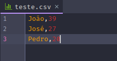
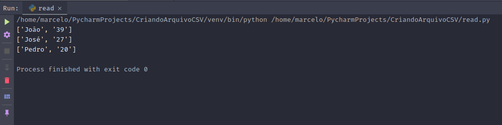
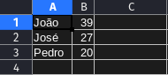

# Criando arquivos CSV em Python

CSV são um tipo que arquivos onde os dados são separados por vígula, dai vem a sigla da extenção CSV(comma-separated values, valores separados por virgula na tradução).

Apesar de na programação existir outros tipos de arquivos que são mais uteis para se trabalhar, como arquivos JSON ou XML, que já possuem funções em quase todas as linguagens para manipular essse tipos de dados, para um usuário que precisa baixar dados de um sistema esses tipos de arquivos podem acabar não sendo a melhor escolha quando este que necessite colocar esses dados em suas planilhas feitas em excel, que é muito utilizado nas empresas.

Dessa forma o arquivo CSV se torna a melhor escolha para essa situação onde é necessário disponibilizar uma quantidade de dados para que o usuário baixe e coloque em planilhas.

Então vamos mostrar como podemos criar, ler e adicionar itens em um arquivo CSV com python.

O **python** já possue o módulo csv em suas bibliotecas *build-in*, dessa forma tudo que precisamos é importar o módulo no início do código.

```python
import csv
```

Agora já temos o o módulo csv para usarmos mais a frente.

Vamos iniciar com o código onde criaremos o arquivo CSV, para isso iremos usar a função `open()` que é utilizada para abrir arquivos. Essa função pode receber alguns parâmetros, daremos atenção apenas nos necessários para atingirmos nosso objetivo.

Os parâmetros que vamos utilizar da função `open()` são: `file, mode`. File é o path do arquivo ou seja o caminho onde ele está ou será criado. Mode é o modo como o arquivo será aberto, os dois principais modos são 'r' para read(leitura) e 'w' para writer(escrita).

Antes de utilizarmos a função`open()` vamos colocar a palavra `with` que irá nos auxiliar fechando o arquivo depois da execução desta tarefa.

Dessa forma nosso código está dessa maneira:

```python
import csv
with open('./teste.csv, 'w') as csvfile:
```

Assim estamos abrindo o arquivo teste.csv, na raiz do projeto e atribuindo a ele uma variável csvfile, que vamos usar para manipular o arquivo.

Um detalhe a se observar é que se o arquivo não existir, ele será criado, pois o parâmetro de escrita('w'), tanto abre um arquivo exitente, como cria o arquivo se ele não existir.

Agora vamos utilizar as algumas funções que o modulo CSV nos disponibiliza, a função `writer()` e a função `writerow()`.

A primera está relacionada ao arquivo criado, permitindo escrever no arquivo que acabamos de criar e irá receber dois paramêtros o a variável com o arquivo, no nosso caso ***csvfile*** e o **delimiter** que é o delimitador do arquivo, nada mais que o caracter que irá separar nos dados no arquivo, nesse caso usaremos a vírgula. Nosso código está assim:

```python
import csv
with open('./teste.csv, 'w') as csvfile:
  csv.writer(csvfile, delimiter=',')
```

Então vamos a outra função que precisamos para poder escrever no arquivo CSV a `writerow()`, que é a função que escreve na linha, essa função deve ser escrita na frente da `writer()` e é dentro dela que vamos escrever os dados, em forma de listas, ficando dessa forma:

```python
import csv
with open('./teste.csv, 'w') as csvfile:
    csv.writer(csvfile, delimiter=',').writerow(['João', '30' ])
    csv.writer(csvfile, delimiter=',').writerow(['José', '27'])
    csv.writer(csvfile, delimiter=',').writerow(['Pedro', '20'])
```

Pronto em nosso código já criamos o arquivo e escrevemos dados nesse arquivo.

{:width=100%}

## Então agora vamos ler o arquivo que acabamos de criar

Vamos abri o arquivo assim como fizemos no código anterior,  porem com uma pequena mudança o parâmetro que usamos anteriormente era 'w', porem agora vamos usar o 'r' de read, ou se preferir não precisa nem colocar o parâmetro pois a função open() por padrão já abre o arquivo mo modo de leitura, então temos um o seguinte:

```python
import csv
with open('./teste.csv) as csvfile:
```

E vamos utilizar a função `reader()` para ler o arquivo que criamos, porem com um detalhe, para termos uma saída estruturada em nosso terminal vamos usar um loop pra iteramos todas as linhas do arquivo, ficando dessa forma:

```python
import csv
with open('./teste.csv) as csvfile:
    for x in csv.reader(csvfile):
      print(x)
```

Assim teremos essa saída no terminal:

{:width=100%}

Pronto já criamos o arquivo e salvamos dados, agora o arquivo pode ser aberto em um editor de planilhas que estará separado de forma correta.

{:width=100%}
