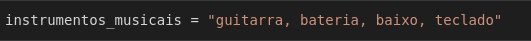
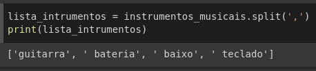
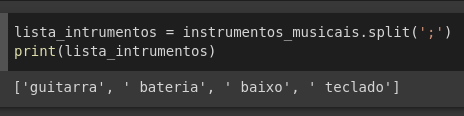

Conversão de tipos dados é algo comum de se precisar na programação. Uma vez que em empresas onde temos vários programadores que desenvolvem e dão manutenção em varias partes diferentes de um sistema, algo normal de se acontecer é ter que se manipular os dados para que possamos usar da melhor forma possível.

Em um outro cenário onde sistemas são projetados para consumir dados de APIs externas onde o desenvolvedor não tem nenhum controle sobre os tipos de dados retornados para a requisição feita pelo sistema, fazer a conversão dos dados pode ser um passo fundamental para o bom funcionamento do sistema.

Supondo que seja feita uma requisição em uma API externa e seu retorno com os dados seja uma string com os dados separados por vírgulas, porem precisamos desses dados em um Array como faríamos? É o que vamos ver!!

Um ponto importante a se dizer a partir de agora é que por padrão o python trata os arrays sendo uma classe do tipo *Lista*, outro ponto é que strings e listas são classes em python, isso está relacionado com o fato do python ser orientado a objetos, mas esse assunto não será abordado aqui, vamos apenas ter em mente que arrays são listas em python, ok?

Sendo assim vamos criar uma string com alguns dados:

{:width=100%}

O fato de uma string ser uma classe nos ajuda, pois podemos executar os métodos que estão implementados nessa classe, por padrão uma string tem alguns métodos que o python disponibiliza, um deles é o `split()` que serve para separar uma string de acordo com os parâmetros passado para esse método, se nada for passado como parâmetro então o a separação será feita por um espaço.

O mais interessante desse método é o seu retorno que é exatamente uma lista, tornando a nossa conversão extremamente simples. Vamos ver abaixo como fazer.

{:width=100%}

Como vemos em uma linha tudo é feito, porem se o separador dos dados for diferente apenas mudamos o parâmetro passado para o método `split()`, supondo que os dados fossem separados por `;` ficaria dessa forma:

{:width=100%}

Python realmente tem algumas coisas que facilitam a programação!

O  que acho dessa dica? Se gostou deixe seu comentário!
